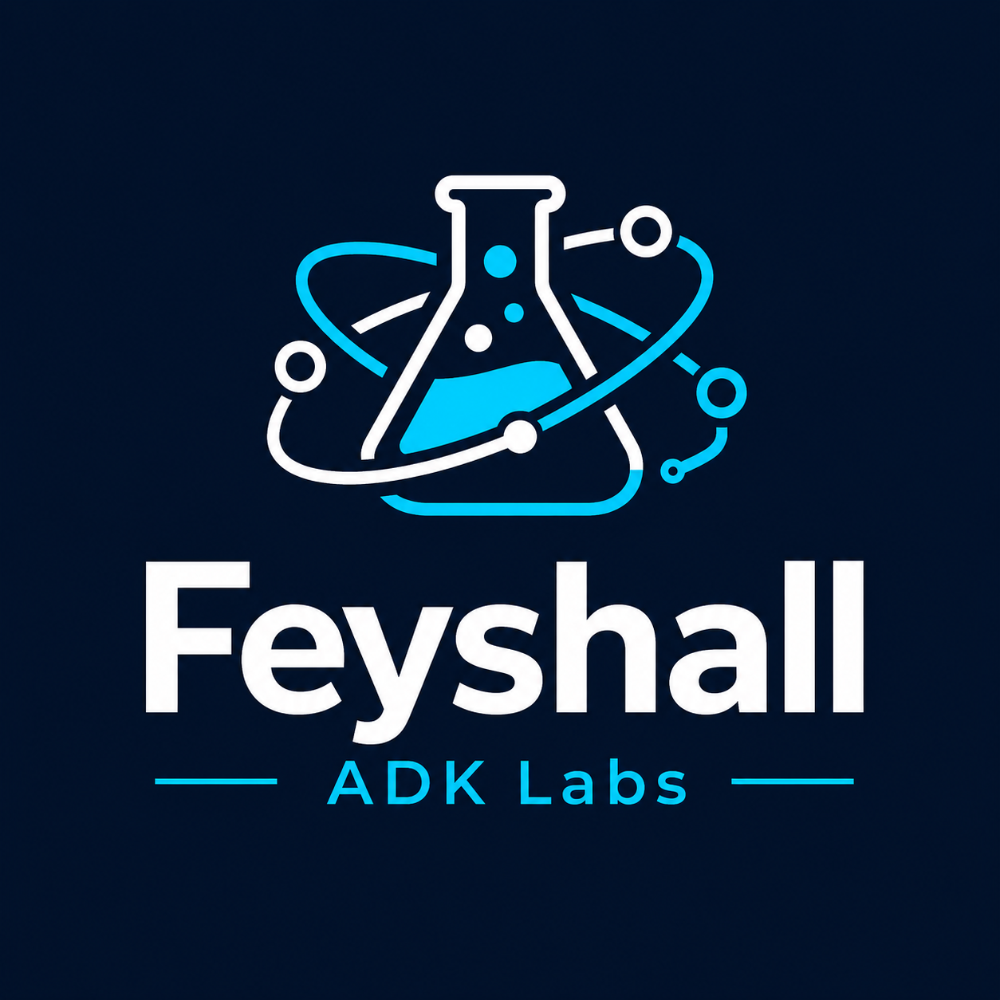

<p align="center">
  <picture>
    <source media="(prefers-color-scheme: dark)" srcset="assets/01_LOGO.png">
    
  </picture>
</p>

<p align="center">
  <a href="README.id.md">🇮🇩 Bahasa Indonesia</a>
</p>

<p align="center">
  
</p>

# feyshall-adk-labs

<p align="center">
  <a href="https://github.com/faisalaffan/feyshall-adk-labs/actions/workflows/eval.yml"></a>
  <a href="https://github.com/faisalaffan/feyshall-adk-labs/actions/workflows/security-scan.yml"></a>
  <a href="https://github.com/faisalaffan/feyshall-adk-labs/actions/workflows/dart.yml"></a>
  <a href="https://github.com/faisalaffan/feyshall-adk-labs/actions/workflows/go.yml"></a>
  <a href="LICENSE"></a>
  <a href="https://github.com/faisalaffan/feyshall-adk-labs"></a>
</p>

Google ADK Cookbook For Better Development Purpose

## Overview

A collection of practical recipes, patterns, and best practices for building with Google Agent Development Kit (ADK). This cookbook provides ready-to-use examples to accelerate your agent-based application development.

See the [Product Requirements Document](docs/PRD.md) for the full roadmap and chapter breakdown.

## Getting Started

```bash
# Clone the repository
git clone https://github.com/faisalaffan/feyshall-adk-labs.git
cd feyshall-adk-labs
```

## Structure

```
feyshall-adk-labs/
├── 00-foundations/          # ADK concepts, lifecycle, hello-world
├── 01-tools/                # Function tools, MCP, auth, error handling
├── 02-multi-agent/          # Orchestration patterns, routing, isolation
├── 03-memory-and-state/    # Sessions, Redis, vector memory
├── 04-streaming/            # SSE, audio, frontend integration
├── 05-evaluation-and-testing/ # Unit tests, eval metrics, CI pipelines
├── 06-observability/        # OTel, LGTM, metrics, alerting
├── 07-deployment/           # Docker, K8s, Vertex AI, Cloud Run
├── 08-enterprise-patterns/  # RBAC, audit, rate limiting, cost mgmt
├── 09-real-world-usecases/  # Inventory, support, code review, ERP
├── _languages/              # Python, Go, Java, Dart setup + SDK
├── .github/workflows/       # CI/CD pipelines
├── helm/                    # Kubernetes Helm chart
├── mkdocs/                  # Documentation site
├── assets/                  # Images and static assets
└── README.md                # You are here
```

## License

This project is licensed under the terms in [LICENSE](LICENSE).
